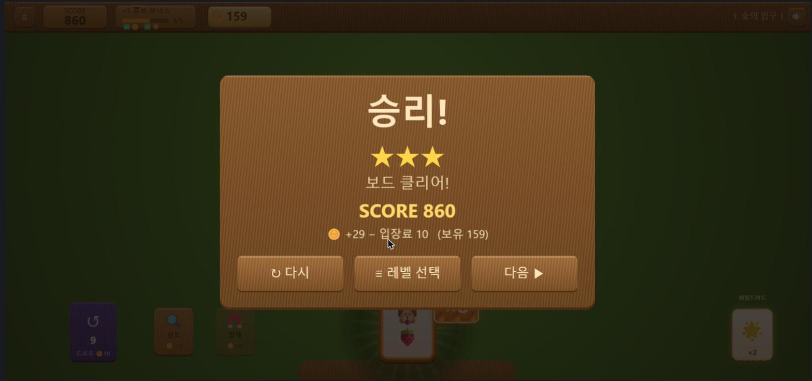
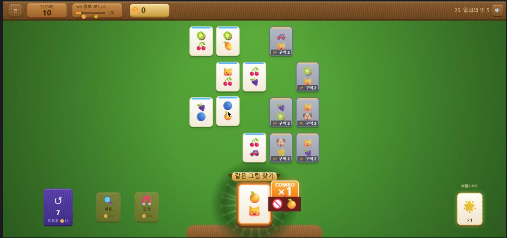
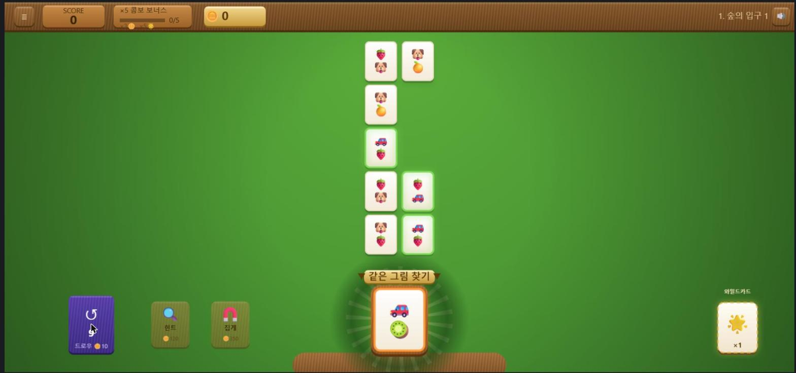

# 기획자 전달 사항 — 2026-08-03 배포본 QA

> 작성: 개발 세션 → 기획자. 8/1 리워크(허들·별점·경제)의 배포본 검증 결과와
> 그 과정에서 찾아 고친 결함 2건, **기획 결정이 필요한 항목 2건** 정리.
>
> 한 줄 요약: **리워크 3종은 배포본에서 전부 정상 동작.** 다만 심사 링크가 이틀간
> 옛 레벨 데이터를 절반 섞어 서빙하고 있었고(수정 완료), 회전·창 크기 변경마다
> 입장료가 다시 나가는 누수가 있었다(수정 완료). 남은 결정: 빈털터리 안전판, 폰 세로 배치.

---

## 1. 리워크 3종 배포본 검증 — 전부 정상 ✅

라이브(https://bjh7536.github.io/combo-match/)에서 브라우저 실플레이로 확인.

| 항목 | 확인 내용 |
|---|---|
| 💰 입장료 | 진입 시 차감·토스트·헤더 플로팅 (레벨 25에서 300→242 실측) |
| 💰 드로우 비용 | 덱 라벨 `드로우 🪙n` 표시, 골드 부족 시 거부 + 덱 미소모 |
| 🚫 노-리피트 | 매치 후 금지 칩 표시, 금지 심볼 거부 문구, 콤보 유지 |
| ⭐ 별점 | 결과 패널 ★ 줄, 선택 화면 `★★★ 860` 표시 (레벨 1 실측 8행동 = ★3) |
| 안전 퇴화 | economy·stars 없는 옛 레벨 데이터에서도 기본값으로 무오류 동작 |

결과 패널 (★ 줄 + 입장료 표기) / 노-리피트 금지 칩:

---

## 2. [수정 완료] 심사 링크가 이틀간 '반쪽 리워크' 상태였다

- **증상**: GitHub Pages CDN이 레벨 JSON을 파일별로 다른 시점 버전으로 서빙.
  8/1 배포 후에도 `level-001.json`·`index.json`은 **7/28본**(입장료·별점 없음),
  `level-025.json` 등은 최신본. `cache: no-store`로도 옛것이 왔고 쿼리스트링을
  붙여야 최신이 왔다. → 심사자는 "레벨 1~24 무료, 25부터 갑자기 유료"를 겪는 상태.
- **원인**: HTML·JS는 해시 파일명이라 무사하지만 JSON은 bare URL — CDN 캐시 무방비.
- **조치**(`07795e2`): 레벨 fetch 전부에 `?v=<빌드ID>` 부착. 배포마다 새 URL이 되어 재발 차단.
  배포 후 실서버에서 레벨 1이 새 데이터(entryFee 10·stars)로 도는 것 확인.
- ⚠️ **주의**: 배포판 `designer.html`의 팩 레벨 불러오기는 여전히 bare URL이라
  옛 데이터가 올 수 있음 (designer.html:1285·1366). **레벨 편집은 로컬 툴 사용 권장.**
  원본 툴 수정 시 같은 방식(`?v=` 부착)으로 맞춰줄 수 있음 — 필요하면 요청 주세요.

---

## 3. [수정 완료] 회전·창 크기 변경마다 입장료 재차감 — 경제 누수

- **경로**: 창 리사이즈/기기 회전 → `main.ts`가 활성 씬 `restart()` → PlayScene
  `create()`가 매번 입장료 차감. **실측: 레벨 1 입장 1회만 했는데 창 크기 변동만으로
  골드 200→130** (QA 세션 중 우연히 발견 — 모바일에선 회전·주소창 개폐가 트리거).
- **조치**: 리사이즈 재구성은 "새 시도"가 아니므로 입장료 면제. **↻ 다시(의도적
  재시도)는 종전대로 차감** — "시도마다 차감" 의도는 유지.
- **알아둘 것**: 리사이즈 재구성이 판 진행도를 리셋하는 것은 **기존 동작**(회전 대응
  트레이드오프)이라 그대로 둠. 이번 수정은 돈만 안 나가게 한 것.

---

## 4. [결정 필요 ①] 빈털터리 나선 안전판 — 2차 보고서 High 항목의 실측 보강

2차 플레이테스트에서 직접 적어준 그 문제가 맞고, 수지 계산이 근거를 보탠다:

| 레벨 | 입장료 | 드로우 1회 | 승리 기본수지* | 패배 수지 |
|---|---|---|---|---|
| 1 | 10 | 10 | **+8** | −5 |
| 20 | 48 | 15 | +27 | −29 |
| 50 | 108 | 20 | +57 | −67 |
| 100 | 208 | 35 | +107 | −129 |

\* 기본골드 − 입장료. 점수 보너스(대략 +10~30)를 더해도 **드로우 2~3회면 이겨도 적자**.
레벨 1 실측: +29 − 입장료 10 = 순익 +19, 드로우 10골드 → 2드로우면 −1.

승률 5할대 플레이어는 골드가 단조 감소 → 골드 0 → **드로우 불가** → 막힘 급등 → 연패 가속.
골드 0 상태 화면 (덱이 7장 남아 있어도 뽑을 수 없다):

**선택지** (2차 보고서 제안 그대로 + 구현 비용):

| 안 | 내용 | 구현 비용 |
|---|---|---|
| A | 판당 첫 드로우 1회 무료 | **몇 줄** — 결정만 주면 즉시 |
| B | 패배 위로금 하한 = 다음 입장료 | 작음 (payout 수정) |
| C | DDA — 2연패 시 덱 +2·입장료 면제 | 중간 (연패 추적 추가) |

심사 관점: 시작 골드 200이라 초반 3~5판 시연에선 나선이 안 나온다. 급하진 않지만
**심사위원이 오래 붙잡고 놀수록 위험**이 커지는 구조라 A만이라도 넣어두는 걸 권장.

---

## 5. [결정 필요 ②] 폰 세로 화면 — 후반 레벨 카드가 물리적으로 작다

아이폰(390×844) 기준 100레벨 전수 계산 (코드가 아니라 **레벨 배치**의 문제):

| 구간 | 터치 권장치(44px) 미만 | 최소 카드 폭 |
|---|---|---|
| 레벨 1~10 | **0/10** | 45px |
| 11~30 | 1~1/10 | 36px |
| 31~50 | 2~3/10 | 30px |
| 51~80 | 4/10 | 24px |
| 81~90 | 4/10 | 23px |
| 91~100 | **6/10** | **21px** (level-092) |

- **원인**: 후반 tripeaks·pyramid가 논리폭 21~32열 — 폰 세로 폭 390px에 우겨넣으면
  물리적 한계. 화면을 더 쓰는 코드 여지는 이미 소진(보드 폭 97% 사용 중).
- **초반은 안전** → 심사·플레이 영상은 초반 레벨 중심이면 문제 없음.
- **제안**: 생성기에 **논리폭 상한 ≤550** (약 7열). level-092를 7열로 접으면 폰에서
  21px→45px, PC 가로에서도 63→57px로 순이득. 단 **tripeaks 3봉우리 실루엣이 사라짐**
  — 형태 정체성 vs 조작성의 기획 판단이 필요. 디자이너 툴의 팩 레벨 편집으로
  표적 재배치(91~100 구간 6개 + 084·096)만 하는 절충안도 가능.
- 참고: PC 가로 화면의 소형화는 3개뿐 — 097·065·049 (세로로 긴 grid, 35~41px).

---

## 6. Minor — 연출 백로그와 묶을 것

- **입장료 토스트 위치**: 보드 카드 위 중앙에 겹쳐 뜬다. 2차 보고서의 "베팅 프레임
  재연출"(Medium)과 같은 자리 — 그때 함께 옮기면 됨.
- 허들 진입 예고 부재(Medium)·별점 실시간 노출(Low) — 2차 보고서 그대로 유효.
- **난이도 표기 역전**: 선택 화면에서 STAGE 3 `21~29` vs STAGE 4 `18~30` — 4가 3보다
  낮게 시작하는 것처럼 보임. 실난이도 문제가 아니라면 표기·팩 순서 확인용 메모.

---

## 부록 — 검증 방법

- 라이브 스모크: 레벨 1(★3 클리어·입장료), 레벨 25(노-리피트·허들), 골드 0 상태
- 게이트: 테스트 221/221 · tsc · 프로덕션 빌드 (수정 커밋마다)
- 세로 화면 수치: `stageSize`+`computeLayout`+레벨 논리폭으로 전수 계산 (실기 미측정 —
  dpr 3 기준 계산값이며 실폰 검증은 미완)
